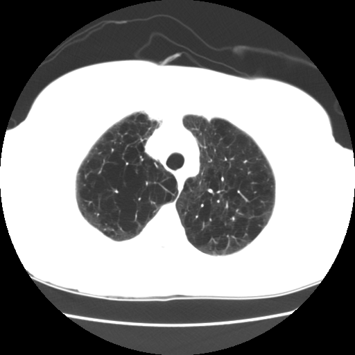
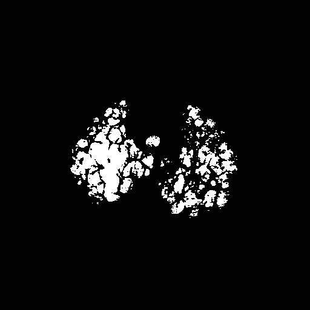
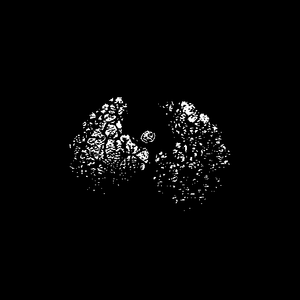
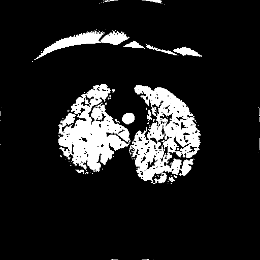
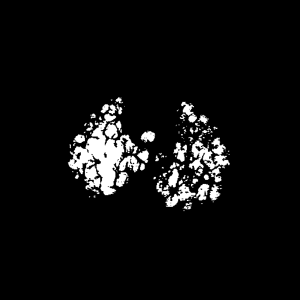

# EmphysemaScoring

Adapted from a [U-Net implementation by zhixuhao](https://github.com/zhixuhao/unet).

---

## Overview

### Dataset

Please download the [LIDC-IDRI database](https://wiki.cancerimagingarchive.net/display/Public/LIDC-IDRI)

### Organizing Data for Training and Evaluation

Please run shell_scripts/prepare_script_lidc_mat.sh and shell_scripts/parallel_script_runs_wrapper.sh in that order. LIDC-IDRI (1010 patients) is partitioned into 10 parts (101 patients each) and each part, in turn, is partitioned into sections a (80 patients) and b (21 patients). In the training-evaluation scheme, 9 parts are used for training (section a) and validation (section b) while the 10th part (sections a and b) is used for evaluation.

* bash shell_scripts/prepare_script_lidc_mat.sh
* bash shell_scripts/parallel_script_runs_wrapper.sh

### Data Preprocessing

shell_scripts/parallel_script_runs_wrapper.sh generates lung RA950 segmentation masks from the LIDC-IDRI CT data

### U-Net Model

We modified the [U-Net implementation by zhixuhao](https://github.com/zhixuhao/unet), which is based on [U-Net: Convolutional Networks for Biomedical Image Segmentation](http://lmb.informatik.uni-freiburg.de/people/ronneber/u-net/), so that the training loss for different samples (e.g. foreground versus background pixels) can be weighted differently.

## Usage

### Dependencies

* Tensorflow
* Keras >= 1.0
* Matlab
* Python >= 2.7

### Preprocessing, Training, and Evaluation

* bash shell_scripts/prepare_script_lidc_mat.sh
* bash shell_scripts/parallel_script_runs_wrapper.sh
* bash shell_scripts/deep_learning_wrapper.sh

## Results

### Slice of Lung CT Scan

### Lung CT RA950 Segmentation Mask

### Lung CT RA950 Predictions

The following image is representative of when the relative segmentation foreground-background sample (pixel) training loss weighting could be increased. The average dice coefficient based on images selected for evaluation was 0.378.

The following image is representative of when the relative segmentation foreground-background sample (pixel) training loss weighting could be decreased. The average dice coefficient based on images selected for evaluation was 0.121.

The following image is representative of when the relative segmentation foreground-background sample (pixel) training loss weighting is just about right. The average dice coefficient based on images selected for evaluation was 0.946.

